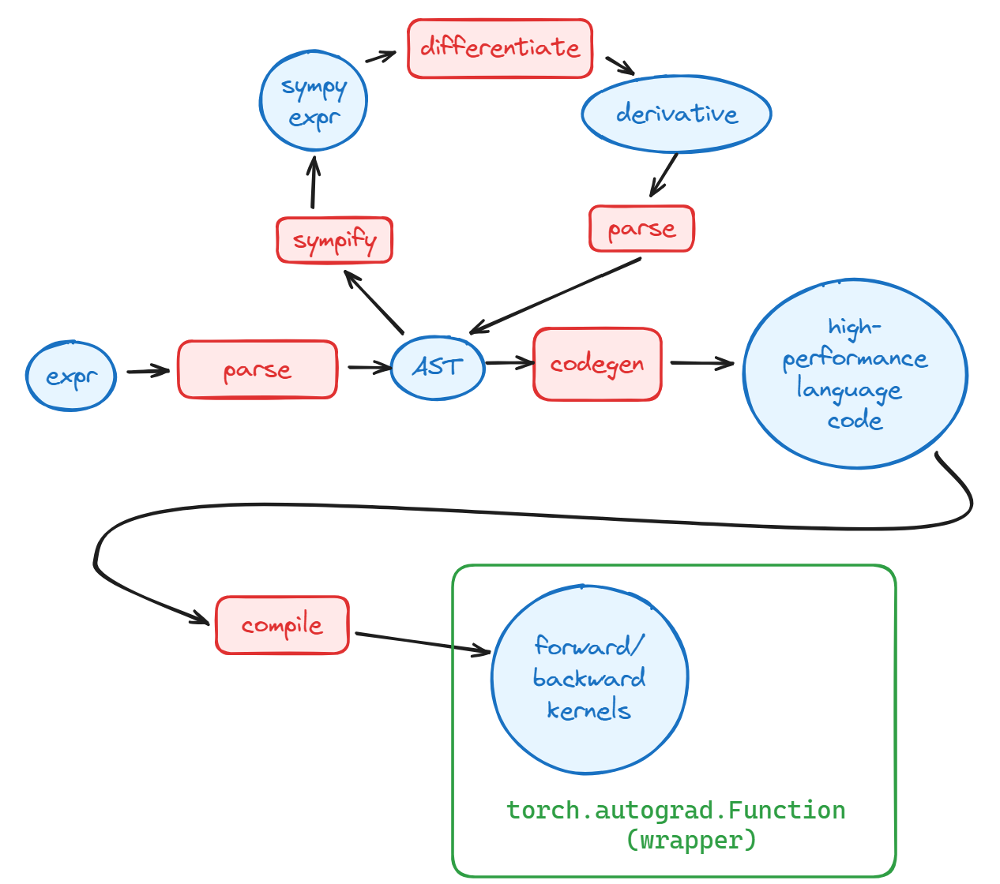

# XMM Prototype

A proof-of-concept implementation of XMM.

## Introduction

XMM, short for **eXtended Matrix Multiplication**, allows you to define your own matmul-like operator, which takes the following form: 

$Z[i,j]=\sum_k\{\mu(A_1[i,k],\dots A_{N_a}[i,k],B_1[k,j],\dots B_{N_b}[k,j])\}$

where $A_i, B_i$ are respectively **row operands** and **column operands**, and $\mu$ the **combinator** is customizable. 

Please refer to `xmm.pdf` for more details.


## TODO & Contribution:
1. I believe the parser part needs to be improved for robustness, so please test and report in issue if failure occurs. Writing massive test or refactoring parser is appreciated :heart:.
2. The current CUDA implementation is completely not optimized. The optimization pattern is nearly identical to *GEMM* optimizations(shared memory -> tiling -> register caching -> prefetch/double buffering...), but it may require careful inspection and modification to make small adjustments and fit our needs. 
- Contribution of optimizing CUDA kernels is appreciated :heart:. 
- Please refer to `xmm/templates/cpp.py` and `xmm/templates/cuda.py` for current naive implementation.
3. Further allow customization of $\sigma$ (in replacement of $\sum$), via a binary function (resembling taking a functor as parameter in `std::reduce` in C++).


## Dependencies

```text
astor
torch
sympy
sortedcontainers
```


## Quick Start

1. Clone this repo.
2. Check `nvcc` compatibility with `torch`.
3. Run `python test.py`
4. [optional] Adjust the `expression` field in `xmmtest.py` to modify the combinator.
- Note: Currently supported functions are listed in the end.


## Example Usage 

See `xmmtest.py` and `polynomials.py` for example usage. 

The example code wraps the operator into a `torch.autograd.Function` and builds a layer on top of it.

Core methods are `SumOperator.__init__`, `op.compile()`, `op.forward()` and `op.backward()`


## Working mechanics



## Supported mathematical functions

```text
['exp', 'log', 'sin', 'cos', 'tan', 'asin', 'acos', 'atan2', 'sinh', 'cosh', 'tanh', 'asinh', 'acosh', 'atanh']
```

